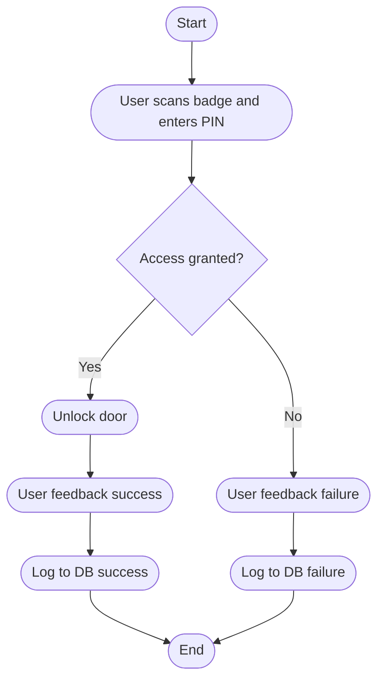

### Narrative

The conceptual network architecture illustrates the major components of the access‑control system and how they communicate across trust boundaries. At the edge of the system is the Raspberry Pi device, which serves as the local controller for badge scanning, PIN entry, and user feedback. A physical number pad is directly attached to the Pi, providing the second factor required for authentication. The Pi communicates with the cloud‑hosted REST API, which performs all authoritative identity and access‑rights validation. The API, in turn, interacts with a PostgreSQL database that stores employee records, badge assignments, and zone entitlements. A developer laptop may also interact with the API for testing or administrative operations, but it does not participate in the live access‑control workflow. This diagram establishes the system’s boundaries, the direction of data flow, and the separation between local device logic and backend decision‑making.

The conceptual workflow diagram captures the high‑level behavior of the system during an access attempt. The process begins when a user presents their RFID badge and enters their PIN. The Pi packages these credentials and sends them to the API for validation. The API returns a deterministic allow/deny decision based on badge status, PIN correctness, employee activity, and zone entitlements. If access is granted, the Pi activates the unlock mechanism and provides positive user feedback. If access is denied, the Pi displays a clear failure message and does not unlock the door. In both cases, the Pi logs the attempt to the backend database, ensuring a complete audit trail. The system then returns to an idle state, ready for the next user. This workflow defines the behavioral contract for the system and ensures consistent, predictable operation across all installations.
