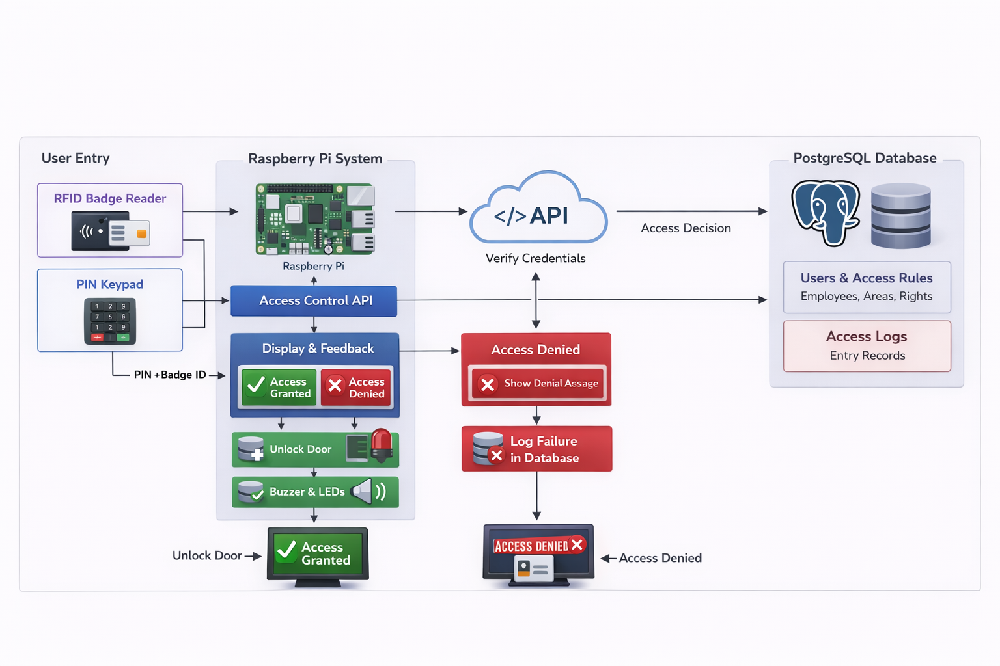

# Access Control System – Process Narrative

This narrative describes the complete end‑to‑end flow of the access control system, from user interaction at the door to final logging in the PostgreSQL backend. It reflects the architecture shown in the system diagram and the required behaviors of the Raspberry Pi, peripherals, API, and database.

## 1. User Entry Phase

A user initiates the process by interacting with two physical input devices:

- **RFID Badge Reader** – captures the badge’s unique identifier (UID).
- **PIN Keypad** – collects the user’s 4‑digit PIN, serving as the second factor of authentication.

These two inputs form the credential package:
**Badge UID + PIN Code**

The Raspberry Pi does not interpret or validate these values locally; it simply collects them and forwards them to the access‑decision subsystem.

## 2. Raspberry Pi Processing

Once both the badge UID and PIN are received, the Pi begins the authentication workflow.

### 2.1 Credential Packaging

The Pi constructs a request payload containing:
- Badge UID  
- PIN  
- Zone code (configured per installation)  
- Device ID  
- Team ID  

This payload is sent to the Access Control API.

### 2.2 API Interaction

The Pi issues a POST request to the API endpoint.  
The API is responsible for:
- Validating the badge  
- Validating the PIN  
- Checking employee status  
- Evaluating access rights for the requested zone  

The API returns a structured response indicating:
- Employee identity  
- Access granted or denied  
- Denial reason (if applicable)

### 2.3 Decision Handling

#### If Access Is Granted
- The Pi activates the unlock mechanism (relay, maglock, or simulated output).
- The Pi provides positive user feedback via display, LEDs, or buzzer.
- A success event is logged.

#### If Access Is Denied
- The Pi displays a denial message to the user.
- No unlocking occurs.
- A failure event is logged, including the denial reason.

## 3. Feedback and Actuation

The Pi provides immediate, local feedback to the user:
- **Access Granted** → door unlock + success indicator  
- **Access Denied** → denial indicator + reason displayed  

This ensures the user receives a clear, unambiguous result without needing to understand backend logic.

## 4. Logging and Persistence

Every access attempt—successful or denied—is recorded in the PostgreSQL database.

### 4.1 Users and Access Rules

Contains:
- Employee records  
- Badge assignments  
- Zone entitlements  
- Status flags (active, inactive, revoked)

This table is read‑only during the project.

### 4.2 Access Logs

Stores:
- Timestamp  
- Badge UID  
- Zone code  
- Device ID  
- Access result  
- Denial reason (if any)  
- Network status (online/offline)  

This log provides the required audit trail for the entire duration of the project.

## 5. End of Flow

After logging, the system returns to its idle state, ready for the next user interaction. No state is carried forward between attempts, ensuring deterministic behavior and preventing cross‑session contamination.
